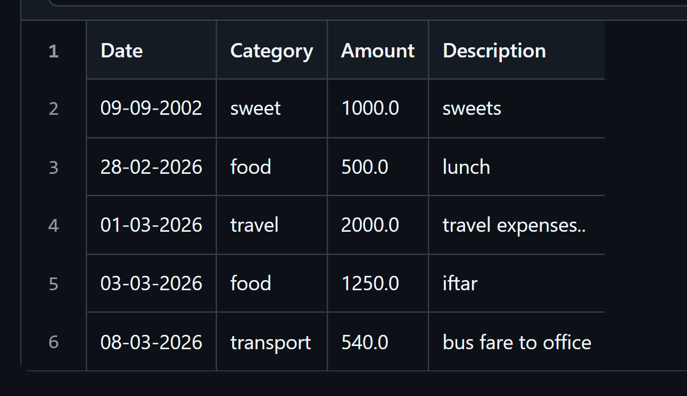

# Expense Tracker App 💰

**Project:** Python Programming Internship – Hex Softwares Pvt. Ltd. (Remote)  
**Intern:** Muhammad Ali (Department of Software Engineering)

---

## 📌 Project Overview
The **Expense Tracker App** is a command-line Python application designed to help users record, manage, and analyze their daily expenses.

This project was developed as part of my **Python Programming Internship at Hex Softwares Pvt. Ltd.**. The application allows users to add, edit, delete, search, and analyze expenses while storing data in a CSV file.

The goal of this project was to apply core Python programming concepts to build a practical and useful financial tracking tool.

---

## 🚀 Features

### Expense Management
- Add new expenses with date, category, amount, and description
- View all recorded expenses in a formatted table
- Edit existing expenses
- Delete unwanted expense records
- Search expenses by date, category, or description

### Expense Analysis
- View total expense summary
- Category-wise expense summary
- Highest spending category detection
- Expense percentage by category

### Budget Control
- Set a budget limit
- Get warning if expenses exceed the budget

### User Experience
- Colored terminal output using **Colorama**
- Clean and structured menu system
- Input validation for better usability

---

## 🧠 Concepts & Technologies Used

- Python Functions
- Lists and Dictionaries
- File Handling (CSV file storage)
- Loops and Conditional Statements
- Exception Handling (`try/except`)
- Data Processing
- String Manipulation
- Python `match-case` statement
- `colorama` library for colored console output

---

## 📂 Project Structure

```
Expense-Tracker-App
│
├── expense_tracker.py
├── expenses.csv
└── README.md
```
---
## ▶️ How to Run the Project

### 1️⃣ Install Python
Make sure Python **3.10 or later** is installed on your system.

### 2️⃣ Clone the Repository
Open a terminal or command prompt and run:

```bash
git clone https://github.com/Muhammad-Ali-Software-Engineer/HexSoftwares_ExpenseTrackerApp/
```
### 3️⃣ Navigate to project folder:
```
cd HexSoftwares_ExpenseTrackerApp
```
### 4️⃣ Install Required Library

Install the Colorama library (for colored terminal output):
```
pip install colorama
```
### 5️⃣ Run the Program
```
python final.py
```

### 6️⃣ Follow on-screen instructions to add, view, edit, and analyze your expenses.

---

## 📋 Application Menu
```
1. Add Expense
2. View All Expenses
3. View Summary
4. Highest Spending Category
5. Expense Percentage by Category
6. Budget Check
7. Search Expense
8. Edit Expense
9. Delete Expense
10. Exit
```
## Example Expense Record
```
Date,Category,Amount,Description
12-06-2025,Food,250,Lunch
13-06-2025,Transport,100,Bus Fare
```
---
## ScreenShot Output CSV File(on github):



---
<h2 align="center">👨‍💻 About Me</h2>

<div align="center">
  <p style="font-size:24">
   Hi, I'm <b>Muhammad Ali</b> 👋<br>
    <p>
    <!-- Skill Icons with text, vertically adjusted -->
     Frontend Developer &emsp;
     UI/UX Designer &emsp;
     Python Enthusiast
  </p>
    🎓 BS Software Engineering Student at University of Gujrat, Pakistan<br>
    Ex-Frontend Development & UI/UX Designing Intern @ CodeAlpha
  </p>

  <p>
    Passionate about Software Engineering, Python, and building projects to strengthen programming concepts.
  </p>
</div>

<div align="center">
  <!-- Contact Icons with original colors, dark-mode friendly -->
  <a href="https://github.com/Muhammad-Ali-Software-Engineer" target="_blank">
    
  </a> &emsp;
  <a href="https://linkedin.com/in/Muhammad-Ali-Software-Engineer" target="_blank">
    
  </a> &emsp;
  <a href="mailto:MuhammadAliOfficial75@gmail.com" target="_blank">
    
  </a>
</div>
